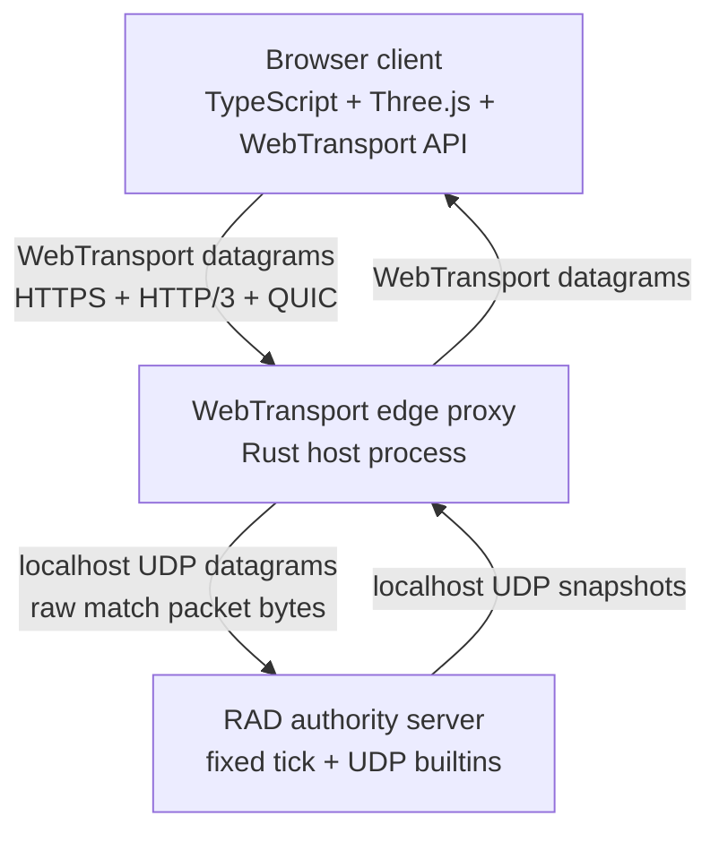

# WebTransport Edge Networking

Browsers cannot open raw UDP or TCP sockets from JavaScript or WASM. For
browser games, RAD uses a host-owned WebTransport edge process and keeps RAD
focused on authoritative simulation and packet semantics.

## Architecture



This is the supported browser networking boundary for `projects/moba-rad`.
There is no HTTP polling bridge and no browser raw-UDP path.

## Responsibility Split

| Layer | Owns | Must not own |
|---|---|---|
| Browser client | input sampling, client prediction, interpolation/reconciliation buffers, Three.js rendering, WebTransport API calls | authoritative movement validation, match rules |
| WebTransport edge proxy | HTTP/3, QUIC, TLS, browser certificate/hash handling, per-session UDP forwarding | champion logic, cooldowns, movement rules, packet grammar changes |
| RAD authority server | fixed tick, ECS state, movement validation, compact packet grammar, snapshots, causality/replay hooks | QUIC/TLS/WebTransport implementation details |

The edge proxy is a host adapter, not a second game server. Its job is to move
opaque bytes between the browser-approved transport and RAD's native UDP
socket. Protocol evolution belongs in RAD and the matching client packet
module, not in the proxy.

Browser clients also own their render and transport lifecycle: cancel the
animation frame, dispose the input controller, dispose Three.js resources, send
best-effort `MatchTransport.disconnect()` for the binary disconnect packet,
then call
`MatchTransport.close()` when a match view shuts down. The proxy and RAD server
should not depend on a tab staying alive forever.

WebTransport sessions are replaceable browser handles. If `transport.closed`
resolves or rejects, or the datagram read loop ends, clear the cached
transport/writer, reject pending sync waiters, and drop old inbox state. The
next input or sync send should reconnect through the same configured
WebTransport URL. Do not patch reconnect by adding HTTP polling or game-state
logic to the edge proxy.

Sync/poll waits are ACK-qualified. The browser transport must not treat an old
state packet already sitting in the latest-state inbox as the response to a new
sync packet. Clear queued states before the sync send, then resolve the sync
wait only when a state for the same session/player has a receipt ACK window
covering that sync packet's `client_seq`. Non-matching snapshots can continue
through the bounded latest-state stream for the frame loop.

Parsed state storage is pooled in the browser transport. The protocol module
can write into caller-provided `ServerState` containers, and
`webTransportStateRouter.ts` rotates through a fixed pool larger than the
latest-state inbox. This keeps high-rate snapshots off the JS allocation path
without moving packet grammar into the edge proxy.

Sync waiters use separate bounded state buffers. When a parsed state ACKs a
requested sync `client_seq`, the browser transport copies it into that waiter's
buffer before resolving the promise. This avoids handing an `await`ing caller a
rotating parse-pool object that a later datagram can mutate.

The RAD authority owns its native UDP lifecycle independently from the edge.
`ServerControl` drives the `main.rad` loop guard, and graceful exit closes the
authority socket with `udp_close`. The WebTransport edge remains a byte-forwarder
and must not become the owner of RAD server socket lifetime.

## Why Not Raw UDP In The Browser

The browser Web Platform does not expose OS UDP sockets to web pages. A browser
client can use WebTransport datagrams, which are unreliable, unordered messages
carried over QUIC through an HTTPS WebTransport session. RAD can use native UDP
builtins on the server side, but those builtins are disabled in the WASM runtime
like other host I/O.

That means the best browser-grade shape is:

1. JavaScript/TypeScript opens `new WebTransport("https://host:port/match")`.
2. The edge process terminates HTTP/3/QUIC/TLS.
3. The edge process forwards datagram payload bytes to the RAD authority over
   localhost UDP.
4. RAD receives `udp_recv_bytebuf_timeout(...)`, dispatches packet kinds in
   `transport/udp_match.rad`, advances the fixed tick in server/sim modules, and
   sends snapshots with `udp_send_bytebuf(...)`.

Within RAD, `transport/udp_match.rad` remains a transport boundary too: it
selects cold-join `full-sync` responses, emits packet status telemetry, and
sends standardized connection errors, while fixed-tick simulation and input
application stay in server/sim modules.

## Current MOBA POC

The current movement POC lives under `projects/moba-rad`, whose root contains
`client/`, `server/`, and a project-local wiki in `docs/`.

For project-local runbooks and ownership rules, see
`projects/moba-rad/docs/`.

Run the RAD authority:

```powershell
cd path\to\rad\projects\moba-rad\server
npm run dev
```

Run the WebTransport edge proxy:

```powershell
cd path\to\rad\projects\moba-rad\server
npm run proxy
```

Run the browser client:

```powershell
cd path\to\rad\projects\moba-rad\client
npm run dev
```

Default ports:

| Service | Default |
|---|---|
| Browser client | `http://127.0.0.1:5174/` |
| WebTransport edge | `https://localhost:4433/match` |
| RAD UDP authority | `127.0.0.1:8788` |

## Certificates

WebTransport requires a secure context. For stable browser runs, give the edge
proxy browser-trusted PEM files:

```powershell
$env:MOBA_RAD_CERT_PEM="H:\path\to\localhost.pem"
$env:MOBA_RAD_KEY_PEM="H:\path\to\localhost-key.pem"
npm run proxy
```

For local experiments without PEM files, the edge proxy creates a short-lived
self-signed identity and prints the certificate SHA-256 hash. Pass that hash to
the Vite client:

```powershell
$env:VITE_MOBA_RAD_WEBTRANSPORT_CERT_HASH="<sha256 hex printed by proxy>"
npm run dev
```

The browser client sends `serverCertificateHashes` with `congestionControl:
"low-latency"` and `requireUnreliable: true`.

## Packet Ownership

The POC packet grammar is intentionally compact binary:

```text
byte 0: magic 0x4d
byte 1: version 10
byte 2: kind
kind 1 sync:       client_seq, session_id, player_id
kind 2 move:       client_seq, session_id, player_id, target_tick, command_id, target_x_i32, target_y_i32
kind 3 disconnect: client_seq, session_id, player_id
kind 4 state:      92-byte local-authority header + peer records + avatar/projectile/impact records
kind 5 error:      status
kind 6 cast:       client_seq, session_id, player_id, target_tick, command_id, dir_x_i32, dir_y_i32, fire_view_tick
```

Single source of truth:

| Side | File |
|---|---|
| RAD server | `projects/moba-rad/server/src/protocol/match_protocol.rad` |
| Browser client | `projects/moba-rad/client/src/transport/matchProtocol.ts` |
| Edge proxy | forwards bytes only; no grammar |

Browser-side protocol support is split by responsibility:
`matchProtocol.ts` owns packet grammar, `matchWire.ts` owns endian/fixed-point
wire helpers, `serverStateBuffer.ts` owns reusable `ServerState` buffers, and
`webTransportStateRouter.ts` owns parse-pool routing, the latest-state inbox,
and ACK-qualified sync waiters.

The current dogfood protocol is `moba-rad/udp-v10-peer-snapshot`. It includes client
sequence numbers, server sequence numbers, session/player identity, target
ticks, authoritative snapshot ticks, ack bitfields, fixed-point coordinates,
compact status/correction-reason codes, cast packets, and authoritative
projectile records plus projectile impact records. The RAD authority remembers
bounded peer entities keyed by `session_id:player_id`, queues each peer's
move/cast inputs into fixed 32-slot target-tick rings, rejects duplicate active
ownership of a `player_id`, handles explicit disconnect packets, expires idle
peers, and applies inputs from the fixed simulation loop. State snapshots also
carry fixed
RAD-authored peer/input telemetry: peer count and capacity, input queue
capacity, pending move/cast counts, late/future/duplicate/overwrite counters,
last seen/applied client sequences, applied ACK bits, and fixed-stride peer
records for connected peers. The browser waits for an initial
authority sync, keeps a typed-array prediction buffer, tracks ack/loss
diagnostics from receipt `ack_bits`, adapts input delay inside a bounded tick
range, reserves command IDs/client sequences/target ticks through a focused
input sequencer, sends fresh move/cast datagrams and bounded resends through
`client/src/app/clientCommandDispatcher.ts` and
`client/src/app/clientInputTransport.ts`, filters authority snapshots through an
authority-state gate, and clears rollback history only through the
server-authored applied ACK window. Gameplay state snaps
immediately, locally applied moves in the rollback window are re-armed before
replay, and the Three.js local avatar mesh applies a short visual-only
correction blend so reconciliation does not produce a hard render jump.

Move and cast packet validation goes through the same RAD input-window helpers
before either ring is mutated, so duplicate, late, and too-far-ahead telemetry is
server-authored and consistent across input kinds. The WebTransport edge still
does not parse those fields.

Client sequence IDs are monotonic and non-wrapping inside a live match session.
The RAD authority rejects sequence IDs that have fallen behind both 32-packet
ACK windows before touching move or cast rings; true sequence-wrap support would
be a protocol upgrade, not a browser transport workaround.

The authority-state gate is browser-side defensive netcode, not edge logic. It
rejects wrong-session/player packets, stale `server_seq` packets, non-u32
tick/sequence/ACK fields, malformed local `target_active`, and non-finite
authoritative local-avatar coordinates before ACK diagnostics, resend selection,
rollback, or Three.js transforms can consume them.

After a snapshot passes the gate, `client/src/app/clientAuthorityApplier.ts`
owns the accepted-snapshot chain: receipt ACK updates, visual projection, clock
sync, applied-input cleanup, scalar reconciliation decision, correction
signaling, and prediction-runner replay. The browser reconciliation policy
decides from scalar fields whether to ignore an older authority echo, accept the
snapshot without replay, replay missing/divergent prediction history, or raise a
hard-correction visual signal. That policy writes into caller-owned scratch so
the requestAnimationFrame path does not allocate while making rollback
decisions. Accepted snapshot presentation flows through
`client/src/app/authoritySnapshotProjector.ts`, which owns remote avatar roster
projection, authority ghosts, projectile meshes, projectile-impact dedupe, and
caller-owned visual stats without teaching the transport or edge proxy any game
semantics.

Parsed state snapshots are also bounded in the browser transport. If datagrams
arrive faster than the frame loop consumes them, `ServerStateInbox` keeps a
small latest-state ring and drops older snapshots so stale authority backlog
cannot grow memory or add latency before reconciliation. `MobaRadClient`
consumes that stream with `MatchTransport.latestState()` every frame; move and
cast inputs are datagram sends, not request/response RPC calls. The
browser reports discarded snapshots through caller-owned HUD diagnostics, but
the WebTransport edge still does not parse or understand any of these fields.

Explicit sync/poll waits use the receipt ACK window instead of that stream:
`client/src/app/clientAuthorityRequester.ts` owns the cadence and in-flight
guard, then calls `MatchTransport.state(clientSeq)`, which waits for a
same-session/player state whose `ack_client_seq`/`ack_bits` cover the sync
packet sequence. RTT and jitter samples are therefore not accidentally measured
against old buffered snapshots.

The read loop hands datagrams to `webTransportStateRouter.ts`, which parses
snapshots into a reusable state pool rather than creating a new object graph for
every 128Hz datagram. `serverStateBuffer.ts` owns those buffer shapes and copy
helpers; ACK-qualified sync replies are copied into bounded waiter buffers
before their promises resolve, so async resync paths do not observe parse-pool
aliasing.

Fresh player inputs are separate from snapshot parsing.
`client/src/app/clientInputController.ts` owns DOM listener state and emits
canvas-space intent. The browser app converts that to scene-derived intent, then
`client/src/app/clientCommandDispatcher.ts` reserves the target tick, records
the prediction-ring entry, schedules the first retry, and hands the fresh send
to `client/src/app/clientInputTransport.ts`. The input transport sends through
`MatchTransport` and reuses one caller-owned input scratch record to pick the
oldest live input not covered by the receipt ACK window. This keeps resend
policy out of WebTransport and out of the Three.js frame coordinator.

The browser client also exposes live netcode telemetry through
`MobaRadClient.writeNetcodeDiagnostics(out)`, filling caller-owned storage for
the debug HUD with authority sync, tick drift, ack/loss, stale/rejected
snapshots, mesh-pool metrics, and latest status/correction reason. The scalar
RTT/jitter, correction, resend, transport-failure, server-peer, and
roster/projectile counters are owned by
`client/src/app/clientNetcodeTelemetry.ts`. Richer authority-side resend policy
tuning and direct WASM-memory resource/config views still belong in
protocol/host modules. Do not add a JSON/HTTP fallback path for those features.

Projectile impact records are deduplicated client-side before they reach scene
code by the authority snapshot projector's fixed `SeenIdRing`, so repeated
snapshots cannot replay the same impact effect and do not allocate per-impact
tracking containers in the render loop.

Periodic netcode report logging is opt-in. Normal play keeps telemetry in the
HUD path; the browser client only constructs `NetcodeLogger` when launched with
`VITE_MOBA_RAD_NETCODE_LOG=1`, keeping console I/O and report formatting out of
the requestAnimationFrame hot path.

## RAD Language Surface

RAD's native networking surface for this architecture is UDP. Competitive game
protocols should use native `bytebuf` datagrams so arbitrary binary payloads
round trip without UTF-8 loss, text parsing, or `list<int>` allocation in the
transport layer:

```rad
let socket = udp_bind("127.0.0.1", 8788)
while true {
    let timeout_ms = authority_udp_timeout_ms(now_unix_ms())
    match udp_recv_bytebuf_timeout(socket, 1200, timeout_ms) {
        Some(packet) => {
            let bytes = packet[0]
            let host = packet[1]
            let port = packet[2]
            let reply = handle_match_datagram_bytes(bytes)
            udp_send_bytebuf(socket, host, port, reply)
        }
        None => nil
    }
    pump_authority_clock(now_unix_ms())
}
```

WebTransport itself is not currently a RAD language builtin. Keeping it in the
host avoids duplicating QUIC/TLS complexity inside the VM and keeps browser
transport churn out of deterministic simulation code.

Future RAD features may expose higher-level host adapters, but the current
project rule is simple: RAD owns match logic and UDP authority; the edge owns
WebTransport.
