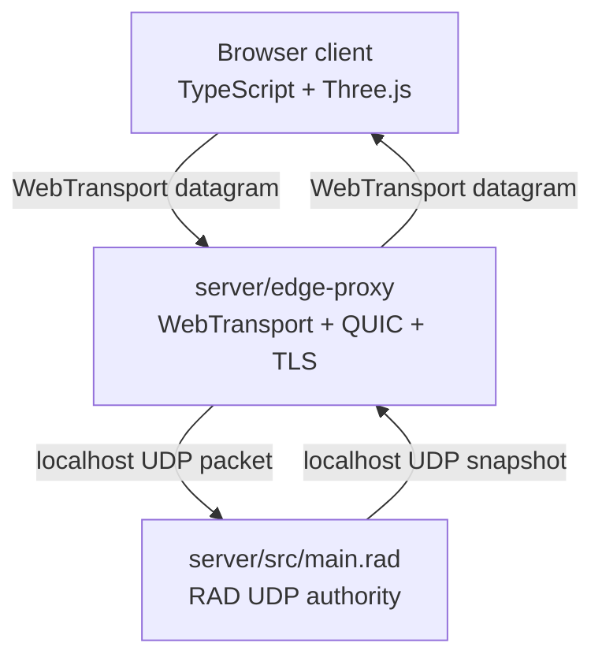

# WebTransport Networking

Browsers cannot open raw UDP sockets from JavaScript or WASM. The browser
client uses native WebTransport datagrams. The edge proxy translates those
browser-approved datagrams into local UDP datagrams for the RAD authority.

## Why The Edge Is Not RAD

WebTransport means HTTP/3, QUIC, TLS, browser certificate rules, and evolving
browser APIs. That is host integration work, not deterministic game simulation.
RAD should own the match state and packet meaning, while the edge moves bytes.
The RAD authority uses `udp_recv_bytebuf_timeout` and `udp_send_bytebuf` for
the competitive packet path. Byte-list UDP builtins are compatibility helpers;
string UDP builtins are only appropriate for diagnostics.

## Edge Proxy Responsibilities

- Accept WebTransport sessions at `/match`.
- Reject unknown WebTransport paths instead of forwarding them.
- Load PEM certificate/key from `MOBA_RAD_CERT_PEM` and `MOBA_RAD_KEY_PEM`, or
  persist a self-signed identity under `MOBA_RAD_CERT_DIR`
  (`server/edge-proxy/.dev-certs` by default) so the browser-pinned SHA-256 hash
  stays stable across reboots. The cert is ECDSA P-256, minted for 14 days, and
  auto-rotated one day early to stay under Chromium's two-week pin limit. The
  Vite dev server reads the same cert file and injects the matching hash, so no
  fingerprint copy-paste is required. See `docs/runbook.md` for the workflow.
- Create one ephemeral localhost UDP socket per browser session.
- Forward browser datagram payloads to the RAD authority.
- Forward authority UDP packets back to the browser as WebTransport datagrams.
- Drop oversized packets instead of allocating unbounded buffers.

## Edge Proxy Non-Responsibilities

- No movement validation.
- No avatar, cooldown, or ability logic.
- No packet grammar parsing.
- No JSON fallback protocol.
- No HTTP polling.

## Files

| File | Purpose |
|---|---|
| `server/edge-proxy/src/main.rs` | WebTransport edge process |
| `client/src/transport/webTransport.ts` | Browser WebTransport adapter |
| `server/src/transport/udp_match.rad` | RAD UDP receive/send loop |
| `server/src/protocol/match_protocol.rad` | RAD packet grammar |
| `client/src/transport/matchProtocol.ts` | Browser packet grammar mirror |
| `client/src/transport/matchWire.ts` | Browser endian/fixed-point wire primitives |
| `client/src/transport/serverStateBuffer.ts` | Browser reusable `ServerState` object graph owner |
| `client/src/transport/webTransportStateRouter.ts` | Browser parsed-state pools, latest-state inbox, and ACK-qualified sync waiters |
| `client/src/app/clientInputController.ts` | Browser DOM input and aim-state owner |
| `client/src/app/clientAuthorityApplier.ts` | Browser accepted authority snapshot owner |
| `client/src/app/clientAuthorityRequester.ts` | Browser ACK-qualified sync/poll owner |
| `client/src/app/clientCommandDispatcher.ts` | Browser target-tick command dispatch owner |
| `client/src/app/clientInputTransport.ts` | Browser fresh input send/resend owner |
| `client/src/app/clientPredictionRunner.ts` | Browser local RAD prediction/replay owner |

The edge proxy forwards binary `sync`, `move`, `cast`, `disconnect`, `state`,
and `error` packets as opaque bytes. It must never parse, validate,
acknowledge, or mutate the match protocol.

Inside the RAD authority, `server/src/transport/udp_match.rad` is still a
transport boundary. It chooses full-sync versus normal state responses, emits
packet status telemetry, and sends standardized player-conflict/peer-table-full
errors. It does not own fixed-tick simulation, movement application, projectile
logic, or replay logging.

RAD currently owns protocol version `moba-rad/udp-v10-peer-snapshot`: session/player
identity, bounded peer creation, duplicate player ownership rejection, explicit
disconnect, peer timeout cleanup, per-peer move/cast target-tick input rings,
ack fields, fixed-point coordinates, status/correction-reason codes, cast
packets, authoritative local state, fixed-stride avatar roster snapshots, and
projectile records all live in `server/src`. State packets also carry fixed
RAD-authored peer/input telemetry plus projectile impact records for
hit/range/lifetime cleanup reasons.

Move and cast packets both pass through the same RAD input-window helpers before
they can mutate their rings. Duplicate, late, and too-far-ahead rejection
counters therefore stay server-authored and consistent across input kinds instead
of being reimplemented in the edge proxy or browser glue.

Client sequence IDs are monotonic and non-wrapping for one live match session.
RAD rejects sequence IDs that are older than both 32-packet ACK windows before
they can touch move/cast rings. If true sequence wrap is ever needed, it belongs
in a new protocol version rather than in WebTransport edge code.

The v10 ACK split is deliberate: `ack_client_seq`/`ack_bits` report packet
receipt at the RAD peer boundary for resend/loss diagnostics, while
`last_applied_client_seq`/`applied_ack_bits` report fixed-tick simulation
consumption for prediction rollback cleanup. The edge proxy still does not know
either meaning.

`client/src/app/clientInputTransport.ts` owns browser fresh move/cast sends and
bounded retransmission. It writes nothing into authority state, does not parse
snapshots, and uses `PredictionBuffer` plus `AckDiagnostics` to resend the
oldest live input missing from the receipt ACK window through the dumb
`MatchTransport`.

State packets also include fixed-stride peer records for connected peers:
session/player identity, pending queue counts, receipt/applied sequence state,
and input rejection counters. These records are owned by RAD and mirrored only
by the browser parser; the WebTransport edge still forwards opaque bytes.

The browser match transport owns its own lifecycle. `MatchTransport.disconnect()`
sends the binary disconnect packet best-effort; `MatchTransport.close()` must
reject pending state waiters and close the WebTransport session. The app calls
both from `MobaRadClient.dispose()` alongside Three.js resource disposal.
Unexpected WebTransport close or datagram-stream end also clears the cached
transport/writer handles, rejects pending sync waiters, and drops old inbox
state so the next input or sync packet can establish a fresh browser transport
session. Reconnect stays in `client/src/transport/webTransport.ts`; do not add a
JSON/HTTP fallback or proxy-side game-state workaround.

The RAD authority owns its native UDP lifecycle separately. `ServerControl`
drives the `main.rad` loop guard, and graceful exit closes the socket with
`udp_close`. The WebTransport edge never owns or closes the RAD authority socket.

Live diagnostics also stay out of the edge. `MobaRadClient.writeNetcodeDiagnostics(out)`
combines packet ACKs, state acceptance/drop counters, and mesh-pool metrics, but
the scalar RTT/jitter, correction, resend, transport-failure, server-peer, and
roster/projectile counters live in `client/src/app/clientNetcodeTelemetry.ts`.
Those values are written into caller-owned telemetry snapshots for the browser
HUD. The edge still does not parse those fields; it only forwards the bytes that
contain them.
`client/src/netcode/authorityStateGate.ts` owns the accepted/stale/rejected
snapshot counters and rejects wrong-session/player packets, stale server
sequence packets, non-u32 tick/sequence/ACK fields, malformed local
`target_active`, and non-finite local-avatar coordinates before ACK diagnostics,
rollback, the client clock, RAD replay state, or Three.js transforms can consume
the snapshot.

After a snapshot is accepted, `client/src/app/authoritySnapshotProjector.ts`
owns the visual projection into remote avatar timelines, authority ghosts,
projectile meshes, and projectile-impact effects. It reuses scratch structs and
a fixed `SeenIdRing`, keeping roster/projectile presentation out of transport,
reconciliation, and requestAnimationFrame allocation paths.

`client/src/app/clientAuthorityApplier.ts` is the owner that wires accepted
snapshots together: it runs the gate, updates receipt ACK diagnostics, projects
visual state, advances the local prediction clock, clears applied input history,
asks the reconciliation policy, and triggers prediction-runner replay. The
WebTransport edge still does not parse or influence any of those decisions.

The browser transport also bounds snapshot backpressure locally. If state
datagrams arrive faster than the app frame loop consumes them,
`ServerStateInbox` keeps only a small latest-state ring and drops older queued
snapshots. `MobaRadClient` reads that stream with `MatchTransport.latestState()`
each frame; move and cast inputs are sent as datagrams, not modeled as
request/response RPC calls. This prevents stale authority packets from becoming
an unbounded JS array or adding artificial latency before reconciliation. The
inbox counts every stale snapshot it discards, and `MobaRadClient` exposes that
count through caller-owned diagnostics for the HUD. It still treats packets as
already-parsed `ServerState` objects; protocol semantics remain in
`matchProtocol.ts` and the RAD authority module.

Fresh input datagrams are separate from snapshot parsing. `ClientInputController`
owns DOM listener state and emits canvas-space intent; `MobaRadClient` converts
that to scene-derived world intent; then `ClientCommandDispatcher` owns
target-tick reservation, prediction-ring writes, first retransmit scheduling,
and the fresh send handoff. `ClientInputTransport` owns the one reusable resend
scratch record and the retry cadence. Reconnect stays below it in
`webTransport.ts`; ACK meaning stays above it in netcode and RAD.

Explicit sync/poll waits must not consume the latest-state backlog as though it
were a fresh reply. `client/src/app/clientAuthorityRequester.ts` owns the
sync/poll cadence and in-flight guard; it calls `MatchTransport.state(clientSeq)`
with a fresh reserved sequence. The transport clears queued inbox snapshots,
sends the sync packet, then waits for a state packet from the same session/player
whose receipt ACK window covers that `clientSeq`. Other state packets continue
into the bounded inbox for the frame loop. This keeps RTT/jitter telemetry and
authority resyncs causally tied to the RAD packet that actually reached the
server.

The browser parser is also pooled. `matchProtocol.ts` owns packet grammar,
`matchWire.ts` owns endian/fixed-point helpers, `serverStateBuffer.ts` owns the
reusable `ServerState` object graph, and `webTransportStateRouter.ts` rotates
through a fixed parse pool larger than the latest-state inbox. This keeps the
128Hz snapshot stream from allocating a fresh object graph for every datagram
while preserving the rule that the edge proxy never parses packet grammar.

Sync/poll replies use a second bounded waiter-state pool. A datagram that ACKs
the requested `clientSeq` is copied into the waiter's buffer before the promise
resolves, so the rotating parse pool cannot mutate a state object while the
client awaits and applies the authority response.

Rollback replay is also explicit client netcode. `client/src/netcode/predictedMoveApplier.ts`
re-arms already-applied move inputs inside the correction window before replaying
them through the local RAD session. Cast records remain in the input ring for
ACK/resend, but they are not replayed as movement.

The rollback decision itself lives in `client/src/netcode/reconciliationPolicy.ts`.
It takes scalar authority/local/prediction fields, suppresses older authority
echoes for newer active local commands, decides whether rollback is required,
and classifies visual corrections without allocating per frame.
